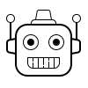

{: .icon }
## Syntax
  
  * [Ramsey's (no relation) *Programming Languages: Build, Prove and Compare*](https://bris.on.worldcat.org/oclc/1369197501).  Is about exploring programming language semantics by writing interpreters.

  * [Aho, Lam, Sethi and Ullman's *Compilers — Principles, Techniques and Tools*](https://bris.on.worldcat.org/v2/oclc/70775643). This one is a rather heavy mix of semi-formal foundations and engineering.  If you want to know much more about parsing and compilation, then this book is for you. 

## Regular Languages

  * [Sipser's *Introduction to the Theory of Computation*](https://bris.on.worldcat.org/v2/oclc/1100692691). We will cover some of the material of Chapter 1 in Weeks 1--4.  Note that Sipser's definitions are generally a bit different, and he uses different notation.  However, they are equivalent to ours, so if you can get over the superficial differences, then this is good supplementary material.  Some of the problem sheet exercises are drawn from this book, which contains many more.

  * [Kozen's *Automata and Computability*](https://bris.on.worldcat.org/v2/oclc/959147733). Chapters 7, 8, 9, 11 and 12 have a lot of overlap with what we will cover.  Some of the problem sheet exercises are drawn from this book, which has many others.

  * [Appel's *Modern Compiler Implementation in ML*](https://bris.on.worldcat.org/v2/oclc/985378534). There are also versions of this book "... in Java" and "... in C" for those who like to hurt themselves.  This has some of the basics of regular expressions and automata.

* * *

<!-- ## Compilation

  * [Appel's *Modern Compiler Implementation in ML*](https://bris.on.worldcat.org/v2/oclc/985378534) again. See the note above if you like to hurt yourself. This provides some more background on the practicalities of turning grammars into (efficient) parsers in general—rather than on a relatively simple example.

  * [Aho, Lam, Sethi and Ullman's *Compilers — Principles, Techniques and Tools*](https://bris.on.worldcat.org/v2/oclc/70775643). This one is a rather heavy mix of semi-formal foundations and engineering. It won't clarify much, but it will allow you to go deeper than we're taking you.

* * * -->

## Operational (and Other) Semantics, Reasoning about Programs

  * [Nielson and Nielson's *Semantics with Applications*](http://www.cs.ru.nl/~herman/onderwijs/semantics2019/wiley.pdf). This covers a version of the While language from abstract syntax onwards.

