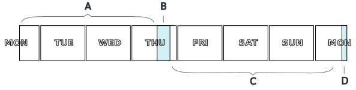

{{'now' | date: '%s' }}
{{ 60 | times: 60 | times: 24 | times: 7 }}
{{ '2021-09-27' | date: '%s'  }}







<h2>At a glance</h2>

Links to the lecture videos, problem sheets and their solutions will appear here as the unit progresses.  Check <a href="#wbyw">below</a> for the links alongside accompanying information.

 
<table class="pure-table-striped pure-table">
  <!-- <thead>
    <tr> 
      <th>Week</th><th>By</th><th>Theme</th><th>Videos</th><th>Problems</th>
    </tr>
  </thead> -->
  <tbody>
    <tr>
      <td colspan="3" style="text-align:center">Welcome Week</td>
    </tr>
    
    
    <tr>
      <td colspan="3" style="text-align:center">Reading Week</td>
    </tr>
    
    <tr>
      <td colspan="3" style="text-align:center">Revision Week</td>
    </tr>
    
    <tr> 
      <td><a href="#week{{ week.num }}">Week {{ week.num }}: {{week.theme}}</a></td><td>{{week.videos}}</td>
      <td>
        
        <a href="questions/sheet{{ week.num }}.pdf">qns</a>
        
        
         / <a href="answers/sheet{{ week.num }}.pdf">ans</a>
        
      </td>
    </tr>
    
    
  </tbody>
</table>

<h2>Day by day</h2>

  
It is helpful to think of each weeks of this unit as running Monday 1pm until the following Monday 1pm.  The pattern of working described below is strongly recommended.

  

  

    <b style="margin:1em">A</b> Watch all the lecture videos and spend at least 2 hours on the problem sheet 
    <b style="margin:1em">B</b> Work on the problem sheet in the lab and get help from the TAs 
    <b style="margin:1em">C</b> Spend up to another 2 hours finishing the problem sheet 
    <b style="margin:1em">D</b> Participate in the online Q&A with the lecturers to resolve any remaining concerns
  

<h2 id="wbyw">Week by week</h2>




<h3 id="week{{ week.num }}">Week {{ week.num }}: {{ week.theme }}</h3>

 - <i style="font-size:90%">Lectured by {{ week.lecturer | replace: "SR", "Steven Ramsay" | replace: "FD", "François Dupressoir" | replace: "AK", "Alex Kavvos" }}</i>

{{ week.description | markdownify }}
  {{ week.num | minus: 1 | times: weekunix | plus: startunix }}
  {{ week.num | times: weekunix | plus: startunix }}
  
  <ul>
    
    <li>Videos:</li>
    
    
    <li>
      Labs: <a href="questions/sheet{{ week.num }}.pdf">qns</a> / <a href="answers/sheet{{ week.num }}.pdf">ans</a>
    </li>
    
    
    <li>Reference: 
        

        
          - <a href="{{ ref }}" target="_blank">{{ ref | split: '/' | last | split: '#' | last | replace: '-', ' ' }}</a> 
        
        

    </li>
    
  </ul>
  




  Icons in this course are from the '<a href="https://icons8.com/icons/carbon-copy" target="_blank">Hand Drawn</a>' icon collection by <a href="https://icons8.com/" target="_blank">Icons8</a>.

