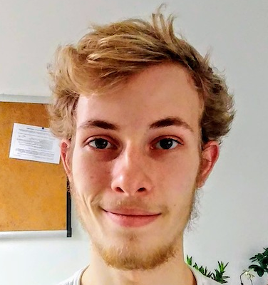
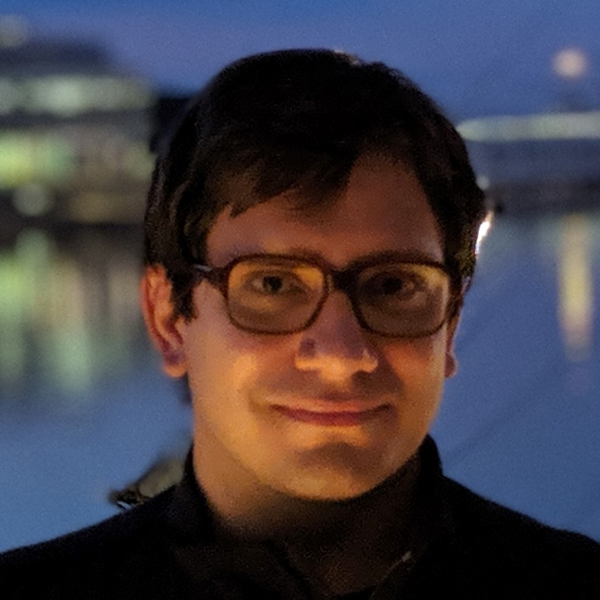
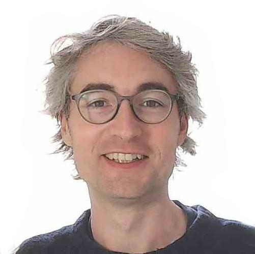

{: .icon }
## Welcome

Welcome to the home of COMS20007: Programming Languages and Computation.  

This 20cp unit introduces you to some of the fundamentals of programming languages and the theory of computation.  Using mathematical techniques, we will study:
  * *Syntax*: how to describe what constitutes a valid program in the given programming language and how to recognise one by parsing.
  * *Semantics*: how to describe what valid programs in the language compute and how to interpret them.
  * *Computability*: how to show that certain functions are or are not possible to implement in the given language, or in any programming language. 

This unit gives you a taster of several important topics in theoretical computer science: [Programming Language Theory](https://en.wikipedia.org/wiki/Programming_language_theory), [Theory of Formal Languages](https://en.wikipedia.org/wiki/Formal_language) and [Computability Theory](https://en.wikipedia.org/wiki/Computability_theory). It prepares you for courses in the programming languages theme in your third and fourth year, especially *COMS30040: Types and Lambda Calculus* and *COMSM0067: Advanced Topics in Programming Languages*.

* * *

{: .icon }
## Contacts

The unit is run by Eddie Jones, Alex Kavvos and Steven Ramsay.

{: .invisitable style="margin:2em 0em 0em 2em;"}
| | |  |
| [Eddie Jones][1] | [Alex Kavvos][2] | [Steven Ramsay][3] |

[1]: https://ec-jones.github.io/
[2]: https://www.lambdabetaeta.eu
[3]: https://sjrsay.github.io

Outside of lectures and labs, please reach out to us via the unit [Team](https://teams.microsoft.com/l/channel/19%3AlnaU_NroshtKCKPoeLz_6Bs1Gdw2aoICitpIqA8C_yc1%40thread.tacv2/General?groupId=622f88b0-18f3-47c4-9c13-9b5707ece47b&tenantId=b2e47f30-cd7d-4a4e-a5da-b18cf1a4151b) rather than by email.  Feel free to ask questions about the unit material, how the units runs, or anything at all to do with programming language theory, formal language theory or computability right in the General channel.  We love to hear what you are thinking!

* * *

{: .icon }
## Schedule

*See [detailed schedule](schedule.html) for a comprehensive day-by-day synopsis.*

The unit is divided into three parts, each of which is run by one of the three lecturers.

{: .pure-table-striped .pure-table}
| Period | Lecturer | Topic |
|:------:|:--------:|:------| 
| Weeks 1-4    | Steven Ramsay | Syntax        |
| Weeks 5,7,8  | Eddie Jones   | Semantics     |
| Weeks 9-11   | Alex Kavvos   | Computability |

 

You should expect to spend around *12 hours per week* working on this unit.  There are 5 main activities (approximate time in parentheses, overall there is some slack):

  * __Lectures (2 hr).__ There are two lectures each week, *Tuesday at 10am* and *Fridays at 12noon*, both in Physics G42 Powell*. 

  * __Labs (2 hr).__  Except in Week 1, labs run every Thursday from 10am-12noon in MVB 2.11 and MVB 1.15.  There are both pen and paper problems and programming tasks to complete.  We have an excellent selection of teaching assistants on this unit, and their sole responsibility in each lab is to *help you*.  Some of the problems are not designed to be solved by a single person in a short amount of time, so you will need the help of the TAs and/or the help of your peers in order to solve them. 

  * __Problem sheets / programming tasks (2-6 hr).__ You will only learn on this unit by completing the problem sheets and programming tasks.  You will spend time working in labs, but you will likely need longer to complete them fully in your own time.

  <!-- * __Office hours (<1 hr).__ Each week there will be office hours with the lecturer, either online or in their office in MVB.  These will be irregular and advertised separately in each week. -->

  * __Reading (2 hr).__  You will often benefit from alternative explanations of the same concepts, which would not fit into the time available for lectures.  You will need to spend time revising and rethinking topics before you can solve the associated problems.

*The most important activity is to give a serious attempt (at least 3 hours) to each problem sheet and get help when you are stuck. The easiest way to do this is to attend the weekly lab.  If you do not, you will likely fail this unit.*

* * *

{: .icon }
## Navigating the course

The unit is distributed over four locations:

* This Blackboard site, which contains:
    - the [welcome page](welcome.html), listing administrative information about the unit
    - the [detailed schedule](schedule.html), which gives brief lecture synopses, the problem sheets and their solutions

* The [notes][rf]{: target="_blank" }, which contains a reference version of technical material introduced in the lectures: you will need to refer to this when completing the problems.  

* The [team][te]{: target="_blank" }, where you post your questions and we do our best to answer them.

[rf]: https://uob-coms20007.github.io/reference/
[lc]: https://github.com/uob-coms20007/labcode
[te]: https://teams.microsoft.com/l/channel/19%3AlnaU_NroshtKCKPoeLz_6Bs1Gdw2aoICitpIqA8C_yc1%40thread.tacv2/General?groupId=622f88b0-18f3-47c4-9c13-9b5707ece47b&tenantId=b2e47f30-cd7d-4a4e-a5da-b18cf1a4151b

* * *

{: style="text-align:center"}
Icons in this course are from the '[Hand Drawn](https://icons8.com/icons/carbon-copy)' icon collection by [Icons8](https://icons8.com/).